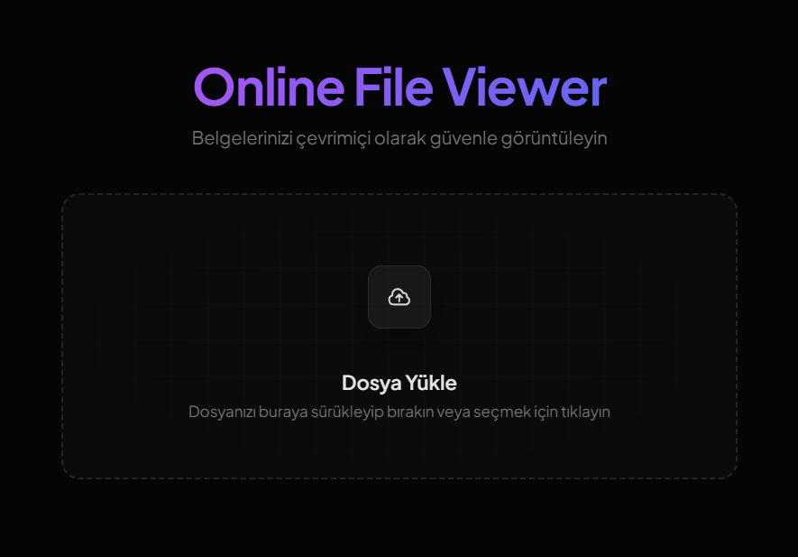
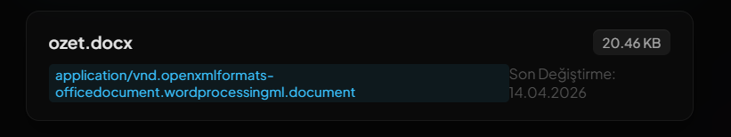
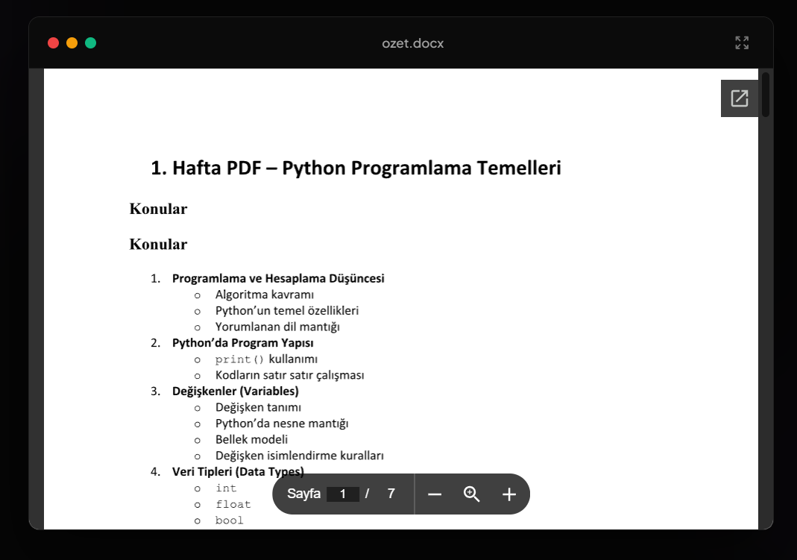

# Online File Viewer (Çevrimiçi Dosya Görüntüleyici)

Bu proje, yüklenen belgeleri (PDF, DOCX, XLSX, PPTX, TXT vb.) sunucuda güvenli ve geçici bir şekilde saklayarak Google Docs Viewer aracılığıyla tarayıcıda görüntülemeyi sağlayan, modern cam efekti (glassmorphism) arayüzüne sahip bir web uygulamasıdır.

Proje, **OWASP Top 10** güvenlik standartlarına uygun şekilde sıkılaştırılmış ve **21st.dev** / **Aceternity UI** sürükle-bırak dosya yükleme arayüzünden esinlenilerek yeniden tasarlanmıştır.

---

## 📸 Ekran Görüntüleri (Screenshots)

*Aşağıdaki ekran görüntülerini alıp proje ana dizininde `assets/` klasörü oluşturarak içine kaydedebilirsiniz. Yer tutucu (placeholder) bağlantıları otomatik olarak aktif olacaktır.*

### 1. Ana Giriş ve Yükleme Ekranı
*Sitenin ilk açıldığı, yükleme kutusunun boş olduğu halinin ekran görüntüsünü alın ve `assets/landing.png` olarak kaydedin.*


### 2. Dosya Detay Kartı
*Bir dosya seçtikten veya sürükleyip bıraktıktan sonra altta açılan dosya adı, boyutu, türü ve düzenleme tarihini gösteren kartın ekran görüntüsünü alın ve `assets/uploaded.png` olarak kaydedin.*


### 3. Belge Görüntüleyici Mockup Penceresi
*Dosya başarıyla yüklendikten sonra altta açılan, sol üstünde kırmızı/sarı/yeşil butonları olan tarayıcı simülasyonu içerisindeki döküman önizleme ekranının görüntüsünü alın ve `assets/viewer.png` olarak kaydedin.*


---

## ✨ Özellikler (Features)

*   **Premium Modern Tasarım:** Derin karanlık mod, cam efekti (glassmorphism) paneller, neon arka plan parlamaları ve "Plus Jakarta Sans" yazı tipi.
*   **21st.dev Sürükle-Bırak:** Hover durumunda yukarı-sağa kayan interaktif dosya yükleme kartı ve arka plan grid deseni.
*   **Otomatik Dosya Temizliği (Lazy Cleanup):** Yüklenen dosyalar sunucuda kalıcı yer kaplamaz. Siteye her girildiğinde veya yeni bir dosya yüklendiğinde, 5 dakikadan eski olan tüm geçici dosyalar sunucudan otomatik olarak silinir.
*   **Tam Ekran Desteği:** Belge görüntüleyici penceresini tek tuşla tam ekran yapabilme özelliği.
*   **Modern Bildirimler:** Hata, bilgi veya başarı durumlarını gösteren cam efektli şık toast bildirimleri.

---

## 🔒 Güvenlik Önlemleri (OWASP Top 10 Hardening)

*   **Broken Access Control & Insecure Design Engelleme:** Yüklenen dosyalar tahmin edilebilir isimlerle (örn: timestamp) kaydedilmez. Bunun yerine kriptografik olarak güvenli 32 karakterli rastgele hex isimleri (`bin2hex(random_bytes(16))`) atanır.
*   **Dosya Yükleme Güvenliği (RCE Engelleme):** `files/` klasörü içerisine yüklenen dosyaların (uzantı kontrolü aşılsa dahi) sunucuda kod yürütememesi için `.htaccess` yapılandırması ile PHP motoru bu klasör için kapatılmıştır.
*   **Klasör İndeksleme Koruması:** `files/` ve `logs/` klasörlerinin dışarıdan taranmasını ve listelenmesini engellemek için dizin indeksleme kapatılmış ve boş `index.html` dosyaları yerleştirilmiştir.
*   **XSS (Cross-Site Scripting) Koruması:** `$_SERVER` global değişkenleri ekrana basılmadan önce `htmlspecialchars` ile tamamen arındırılmıştır.
*   **Güvenli Hata Yönetimi:** Hatalar ekrana basılmak yerine dışarıdan erişilemeyen güvenli `logs/php_errors.log` dosyasına yazılır.
*   **Token Korumalı Manuel Temizlik:** `temizle.php` dosyası token doğrulaması ile korunmaktadır. Doğru token olmadan çalıştırıldığında tüm dosyaları silmek yerine yalnızca 5 dakikadan eski geçici dosyaları temizler.

---

## 🚀 Kurulum ve Çalıştırma

### Gereksinimler
*   PHP 7.4 veya üzeri
*   Apache Web Server (Örn: XAMPP, WampServer vb.) ya da `.htaccess` destekleyen herhangi bir web sunucusu.

### Adımlar
1.  Bu depodaki tüm dosyaları indirin ve web sunucunuzun kök dizinine (örn: `htdocs/ofv` veya `www/ofv`) kopyalayın.
2.  Proje klasöründe `files` ve `logs` isimli iki klasörün otomatik oluştuğundan veya mevcut olduğundan emin olun.
3.  Tarayıcınızdan `http://localhost/ofv` adresine giderek uygulamayı çalıştırın.

> [!IMPORTANT]
> **Önemli Not (Google Viewer Gereksinimi):** Google Docs Viewer API'sinin dökümanları çekebilmesi için web sitenizin **internet ortamında erişilebilir (kamusal bir domainde veya ngrok tünelinde)** olması gerekmektedir. `localhost` üzerindeki yerel testlerde Google sunucuları yerel dosyanıza erişemeyeceği için belge görüntüleme ekranı hata verebilir.

---

## 🔑 Manuel Temizlik Endpoint Kullanımı

Eğer dosyaları manuel olarak temizlemek isterseniz tarayıcıdan veya bir cron job ile aşağıdaki adrese istek atabilirsiniz:

*   **Güvenli Temizlik (Sadece 5 dakikadan eski dosyaları siler):**
    ```
    http://siteniz.com/temizle.php
    ```
*   **Tam Temizlik (Klasördeki tüm geçici dökümanları siler):**
    ```
    http://siteniz.com/temizle.php?token=ofv_secure_cleanup_token_2026
    ```
    *(Not: `temizle.php` dosyasındaki `$secretToken` değişkenini dilediğiniz gibi güncelleyebilirsiniz.)*
